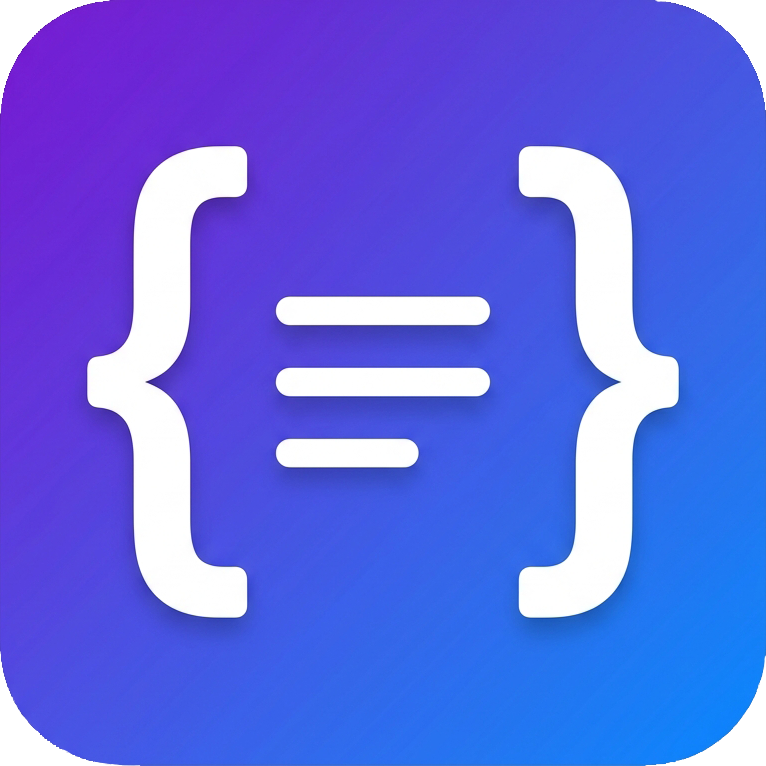
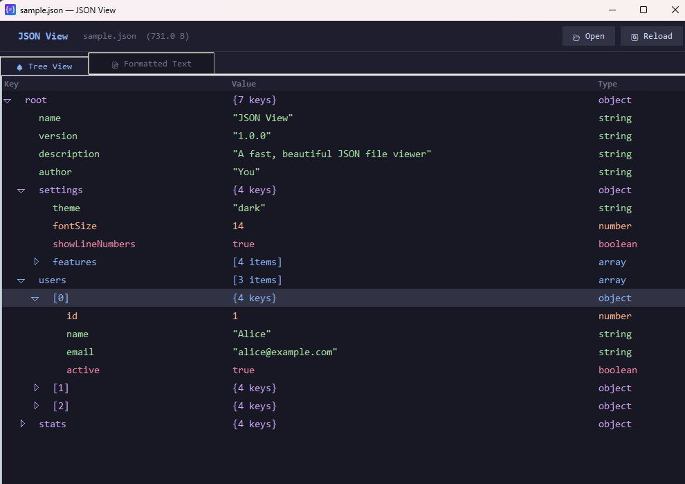
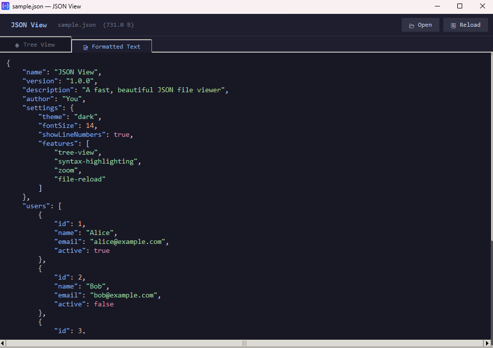

# JSON View

A fast, beautiful JSON file viewer with a dark theme. Opens JSON files and displays them in a structured, readable tree view with syntax highlighting.

<div align="center">
  
</div>

## Screenshots

<div align="center">
  
  
</div>

## Features

- **🚀 Super fast** — Opens and formats JSON files instantly
- **🌳 Tree View** — Hierarchical tree view showing keys, values, and types
- **📝 Formatted Text** — Pretty-printed JSON with syntax highlighting
- **🎨 Dark Theme** — Easy on the eyes with a modern color scheme
- **🔍 Zoom** — Ctrl+/- to zoom in and out
- **📂 Drag & Drop** — Drop JSON files directly onto the window
- **🔄 Live Reload** — Press F5 to reload the current file
- **🖱️ Right-Click Menu** — "Open with JSON View" in Windows Explorer
- **📎 Default Handler** — Can be set as the default .json file opener

## Quick Start

### Run directly (no build needed)

```bash
python json_view.py                    # Launch app
python json_view.py myfile.json        # Open a specific file
```

### Keyboard Shortcuts

| Shortcut | Action |
|----------|--------|
| `Ctrl+O` | Open file |
| `Ctrl+Q` | Quit |
| `Ctrl++` | Zoom in |
| `Ctrl+-` | Zoom out |
| `F5` | Reload current file |

## Building

### Prerequisites

```bash
pip install -r requirements.txt
```

For building the Windows installer, you also need to install [Inno Setup 6](https://jrsoftware.org/isinfo.php).

### Windows

```bash
# Build the executable
build_windows.bat

# Output: dist/JSON View.exe

# Build the Windows installer (requires Inno Setup 6)
build_installer.bat

# Final installer output: dist/json-view-setup-v0.1.0.exe
```

### macOS (Apple Silicon & Intel)

```bash
chmod +x build_mac.sh
./build_mac.sh

# Output: dist/JSON View
```

The macOS build uses `--target-architecture universal2` to produce a universal binary that runs natively on both Apple Silicon (M1/M2/M3/M4) and Intel Macs.

## Windows Integration

### Using the Installer (Recommended)
The generated Windows installer natively handles adding context menus, shortcuts, and default application associations. During installation, you will have the option to:
1. Set JSON View as the default `.json` file opener
2. Add "Open with JSON View" to the right-click menu for `.json` files
3. Add a general "Open with JSON View" option for all files

### Manual Installation (Portable Mode)

If you use the portable executable (`JSON View.exe`) without installing it, you can manually set up right-click menus. Run **as Administrator**:

```
install_context_menu.bat
```

This will manually register JSON View classes in the registry.

### Uninstall Manual Integration

Run **as Administrator**:

```
uninstall_context_menu.bat
```

## Project Structure

```
json-view/
├── json_view.py              # Main application
├── create_icon.py             # Icon converter (PNG → ICO/ICNS)
├── icon.png                   # App icon (source)
├── icon.ico                   # App icon (Windows)
├── icon.iconset/              # App icon (macOS iconset)
├── build_windows.bat          # Windows build script
├── build_mac.sh               # macOS build script
├── install_context_menu.bat   # Windows: install right-click & default
├── uninstall_context_menu.bat # Windows: uninstall right-click & default
├── requirements.txt           # Python dependencies
├── sample.json                # Sample JSON for testing
└── README.md                  # This file
```

## Requirements

- Python 3.8+
- tkinter (included with Python)
- Pillow (for icon generation only)
- PyInstaller (for building executables only)

## License

[MIT](LICENSE)
